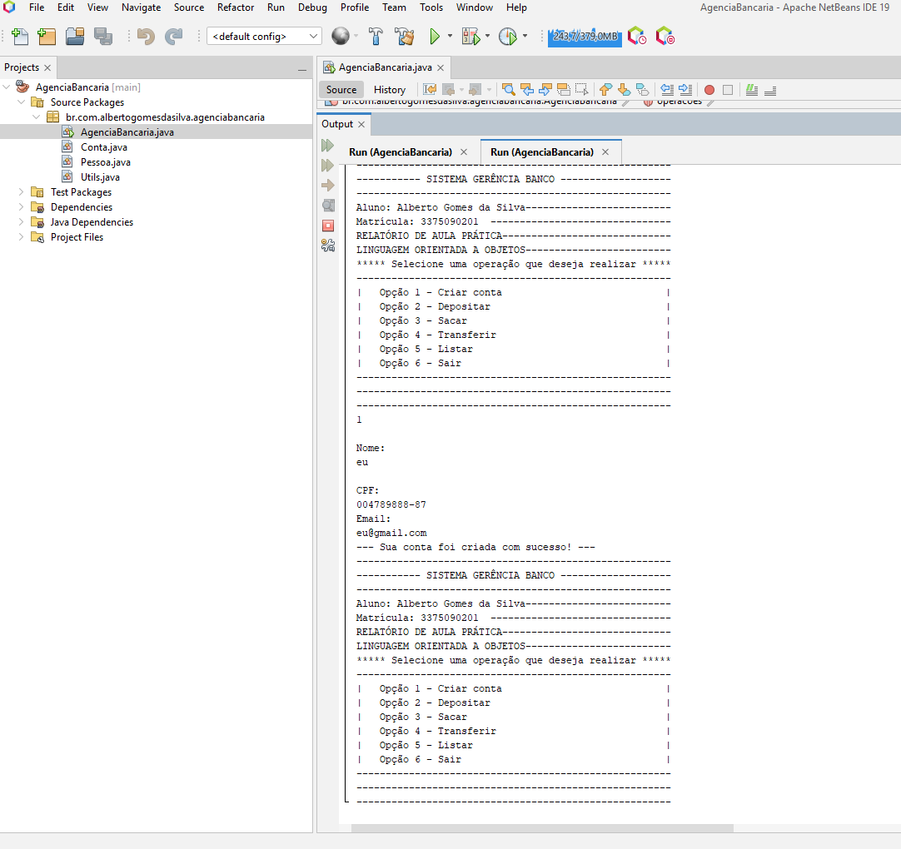

1. Atividade proposta:

Utilizando os principais conceitos do paradigma de Orientação a Objetos, crie uma pequena aplicação de
gerenciamento bancário que possibilite ao usuário informar seu nome, sobrenome e CPF. Além disso, a
aplicação deverá possibilitar ao usuário consultar saldo, realizar depositos e saques. Esses
procedimentos devem se repetir até que o usuário escolha encerrar o uso da aplicação.

2 - Em seguida, deve-se avançar e, na tela seguinte, dar o nome ao projeto. Como já mencionado,
sugere utilizar o nome gerenciaBanco.

3 - Construa a aplicação em um único arquivo do tipo java main Class. Isso porque o método principal,
que é chamado pela maquina virtual, deve estar nesse mesmo arquivo.

4 - No seu código você deverá construir, basicamente:
a) a classe principal
b) classe para para dados pessoais e operações bancárias
c) método para exibição do menu.
5 - Para a exibição do menu, será necessário utilizar uma estrutura de decisão para tratamento das
escolhas do usuário. Sugere-se utilizar a estrutura do...while e switch..case.

https://albertogomesdasilva.github.io/projeto-java-gerenciabanco/

/************************************************************************************

Relatório de Aula Prática: Desenvolvimento de um Sistema Bancário Básico em Java no NetBeans

Introdução:

A aula prática consistiu no desenvolvimento de um sistema bancário básico utilizando a linguagem de programação Java e a IDE NetBeans. O objetivo desse projeto foi criar um aplicativo simples que permite aos usuários realizar operações bancárias como depósitos, saques e consultas de saldo.

Métodos:

1. Estruturação do Projeto:

Para começar, criamos um novo projeto no NetBeans e o estruturamos em classes Java. As principais classes desenvolvidas foram:

ContaBancaria: Esta classe representou uma conta bancária e incluiu métodos para realizar depósitos, saques e consultar o saldo.
Banco: Uma classe que gerencia as contas bancárias e permite a criação, exclusão e listagem das contas.
Principal: A classe principal do projeto que contém o método main para iniciar a aplicação.
2. Implementação das Funcionalidades:

Desenvolvemos os métodos dentro das classes ContaBancaria e Banco para permitir as operações básicas de um sistema bancário. Foram implementadas as seguintes funcionalidades:

Criar uma nova conta bancária.
Depositar dinheiro em uma conta.
Realizar saque de uma conta.
Consultar o saldo de uma conta.
3. Interface do Usuário:

Criamos uma interface de texto simples que permite aos usuários interagirem com o sistema. Utilizamos menus e prompts para coletar a entrada do usuário e exibir informações.

Resultados:

O sistema bancário básico desenvolvido na aula prática permite que os usuários criem contas bancárias, realizem depósitos, saques e consultem seus saldos. As operações são executadas com sucesso e o sistema apresenta mensagens informativas ao usuário. O código foi testado e não apresentou erros durante a execução.

Conclusão:

A aula prática de desenvolvimento de um sistema bancário básico em Java no NetBeans foi bem-sucedida na criação de um aplicativo funcional que atende aos requisitos estabelecidos. Os alunos tiveram a oportunidade de aplicar os conceitos de orientação a objetos, criar classes, métodos e interagir com o usuário por meio de uma interface de texto.

Além disso, a prática permitiu a compreensão dos conceitos fundamentais de programação, como encapsulamento, herança e polimorfismo, bem como a manipulação de estruturas de controle e de dados em Java.

Em resumo, a aula prática proporcionou aos alunos uma valiosa experiência de desenvolvimento de software em Java e uma introdução aos princípios de programação orientada a objetos, que são amplamente utilizados na indústria de software.

/*************************************************************************************

/*
 * Click nbfs://nbhost/SystemFileSystem/Templates/Licenses/license-default.txt to change this license
 */

package br.com.albertogomesdasilva.gerenciabanco;

/**
 *
 * @author alber
 */
import java.util.ArrayList;
import java.util.Iterator;
import java.util.Scanner;

class ContaBancaria {
    private String nome;
    private String sobrenome;
    private String cpf;
    private double saldo;

    public ContaBancaria(String nome, String sobrenome, String cpf) {
        this.nome = nome;
        this.sobrenome = sobrenome;
        this.cpf = cpf;
        this.saldo = 0.0;
    }

    public String getNomeCompleto() {
        return nome + " " + sobrenome;
    }

    public String getCpf() {
        return cpf;
    }

    public double getSaldo() {
        return saldo;
    }

    public void depositar(double valor) {
        saldo += valor;
        System.out.println("Depósito de R$" + valor + " realizado com sucesso.");
    }

    public boolean sacar(double valor) {
        if (valor > saldo) {
            System.out.println("Saldo insuficiente para saque.");
            return false;
        } else {
            saldo -= valor;
            System.out.println("Saque de R$" + valor + " realizado com sucesso.");
            return true;
        }
    }
}

public class GerenciaBanco {
    private static ArrayList<ContaBancaria> contas = new ArrayList<>();

    public static void main(String[] args) {
        menu();
    }

    public static void menu() {
        Scanner input = new Scanner(System.in);

        System.out.println("|   Opção 1 - Criar conta                            |");
        System.out.println("|   Opção 2 - Depositar                              |");
        System.out.println("|   Opção 3 - Sacar                                  |");
        System.out.println("|   Opção 4 - Transferir                             |");
        System.out.println("|   Opção 5 - Listar contas                          |");
        System.out.println("|   Opção 6 - Deletar conta                          |");
        System.out.println("|   Opção 7 - Sair                                   |");

        System.out.print("Digite uma Opção: ");

        int operacao = input.nextInt();

        switch (operacao) {
            case 1:
                criarConta();
                break;
            case 2:
                depositar();
                break;
            case 3:
                sacar();
                break;
            case 4:
                transferir();
                break;
            case 5:
                listarContas();
                break;
            case 6:
                deletarConta();
                break;
            case 7:
                System.out.println("Encerrando o Sistema.");
                input.close();
                System.exit(0);
            default:
                System.out.println("Opção inválida!");
                break;
        }

        menu();
    }

    public static void criarConta() {
        Scanner scanner = new Scanner(System.in);
        System.out.print("Digite seu Nome: ");
        String nome = scanner.nextLine();
        System.out.print("Digite seu Sobrenome: ");
        String sobrenome = scanner.nextLine();
        System.out.print("Digite seu CPF: ");
        String cpf = scanner.nextLine();

        ContaBancaria conta = new ContaBancaria(nome, sobrenome, cpf);
        contas.add(conta);

        System.out.println("Conta criada com sucesso para: " + conta.getNomeCompleto() + " - CPF: " + conta.getCpf());
    }

    public static void depositar() {
        Scanner scanner = new Scanner(System.in);
        System.out.print("Digite o CPF da conta para depositar: ");
        String cpf = scanner.nextLine();
        System.out.print("Digite o valor a ser depositado: ");
        double valor = scanner.nextDouble();

        ContaBancaria conta = encontrarConta(cpf);

        if (conta != null) {
            conta.depositar(valor);
        } else {
            System.out.println("Conta não encontrada para o CPF fornecido.");
        }
    }

    public static void sacar() {
        Scanner scanner = new Scanner(System.in);
        System.out.print("Digite o CPF da conta para sacar: ");
        String cpf = scanner.nextLine();
        System.out.print("Digite o valor a ser sacado: ");
        double valor = scanner.nextDouble();

        ContaBancaria conta = encontrarConta(cpf);

        if (conta != null && conta.sacar(valor)) {
            System.out.println("Saque realizado com sucesso.");
        } else {
            System.out.println("Operação de saque falhou.");
        }
    }

    public static void transferir() {
        Scanner scanner = new Scanner(System.in);
        System.out.print("Digite o CPF da conta de origem: ");
        String cpfOrigem = scanner.nextLine();
        System.out.print("Digite o CPF da conta de destino: ");
        String cpfDestino = scanner.nextLine();
        System.out.print("Digite o valor a ser transferido: ");
        double valor = scanner.nextDouble();

        ContaBancaria contaOrigem = encontrarConta(cpfOrigem);
        ContaBancaria contaDestino = encontrarConta(cpfDestino);

        if (contaOrigem != null && contaDestino != null) {
            if (contaOrigem.sacar(valor)) {
                contaDestino.depositar(valor);
                System.out.println("Transferência de R$" + valor + " realizada com sucesso.");
            } else {
                System.out.println("Transferência falhou. Saldo insuficiente na conta de origem.");
            }
        } else {
            System.out.println("Contas não encontradas para os CPFs fornecidos.");
        }
    }

    public static void deletarConta() {
        Scanner scanner = new Scanner(System.in);
        System.out.print("Digite o CPF da conta a ser deletada: ");
        String cpf = scanner.nextLine();

        Iterator<ContaBancaria> iterator = contas.iterator();
        while (iterator.hasNext()) {
            ContaBancaria conta = iterator.next();
            if (conta.getCpf().equals(cpf) && conta.getSaldo() == 0) {
                iterator.remove();
                System.out.println("Conta deletada com sucesso.");
                return;
            }
        }

        System.out.println("Conta não encontrada ou saldo não é zero. Não foi possível deletar.");
    }

    public static void listarContas() {
        System.out.println("Listagem de Contas:");
        for (ContaBancaria conta : contas) {
            System.out.println(conta.getNomeCompleto() + " - CPF: " + conta.getCpf() + " - Saldo: R$" + conta.getSaldo());
        }
    }

    private static ContaBancaria encontrarConta(String cpf) {
        for (ContaBancaria conta : contas) {
            if (conta.getCpf().equals(cpf)) {
                return conta;
            }
            
        }
        return null;
    }
}

